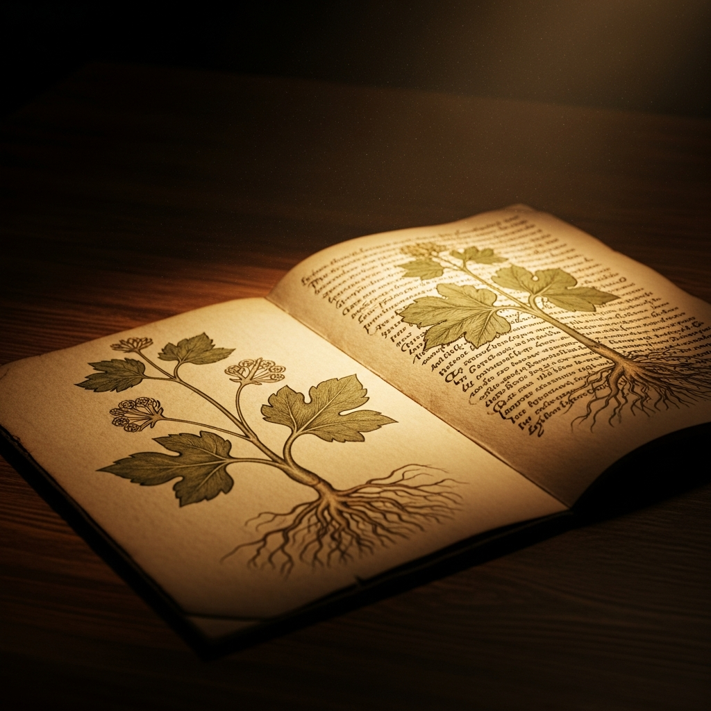
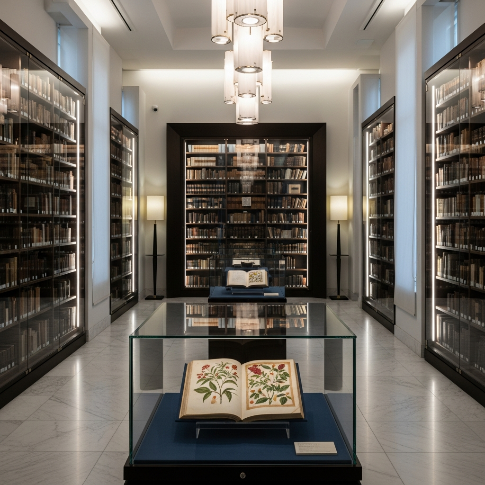
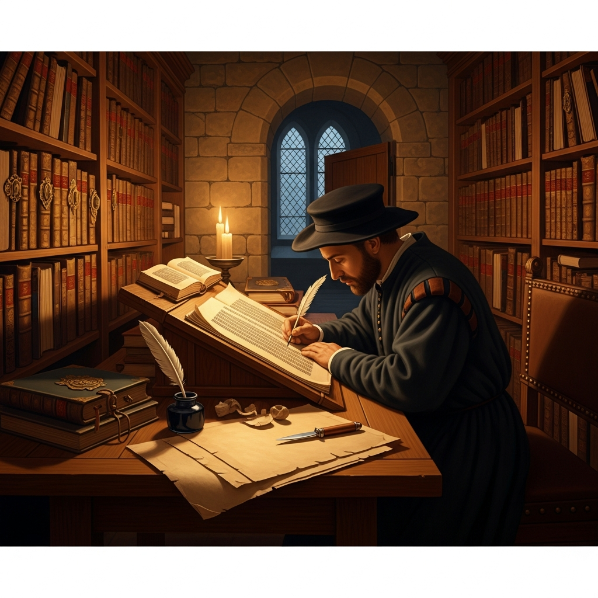
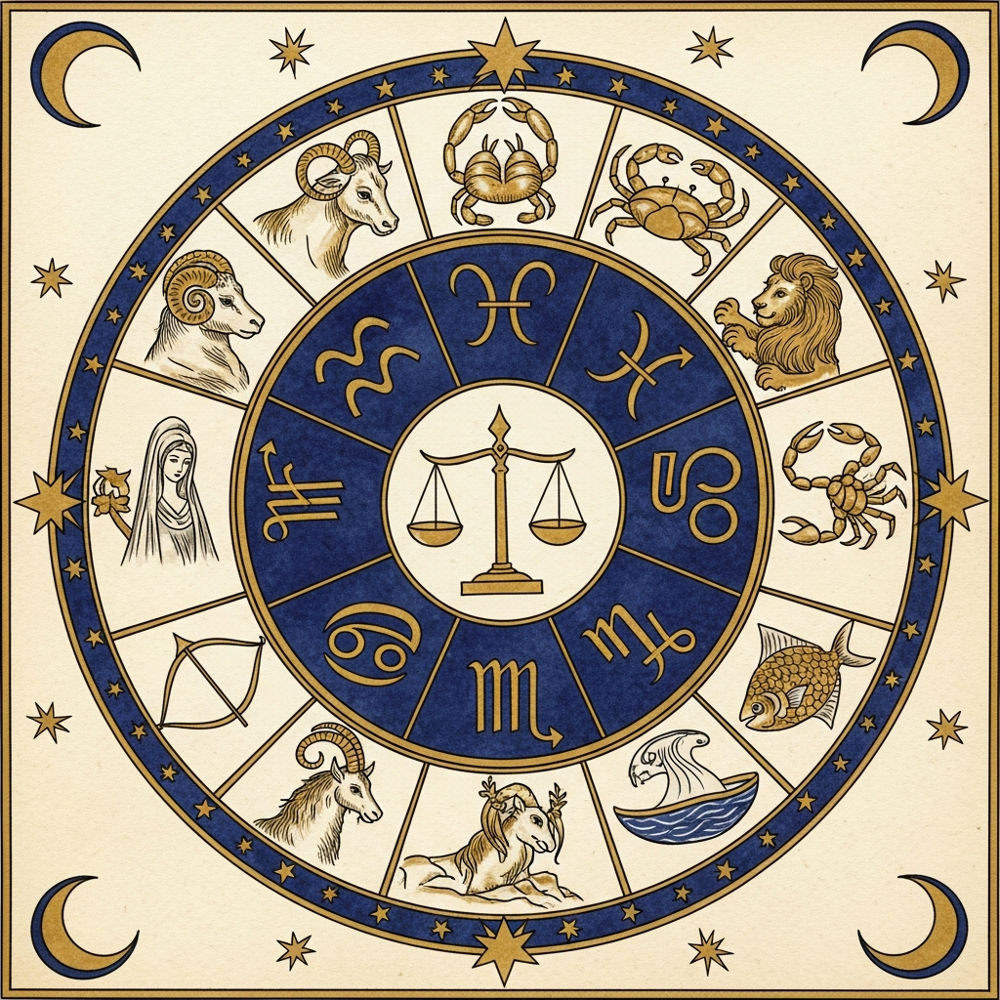
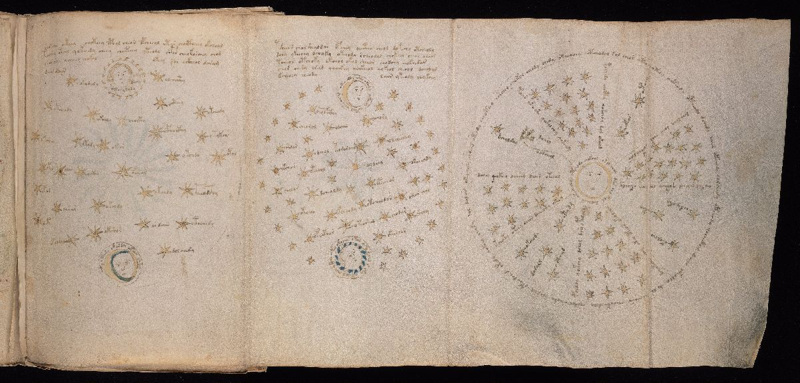
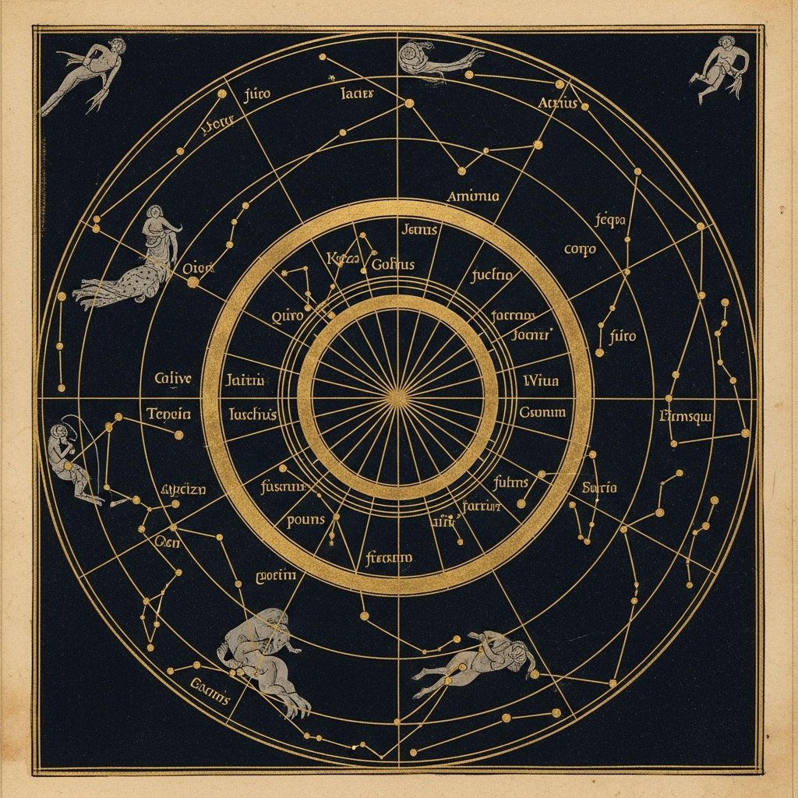
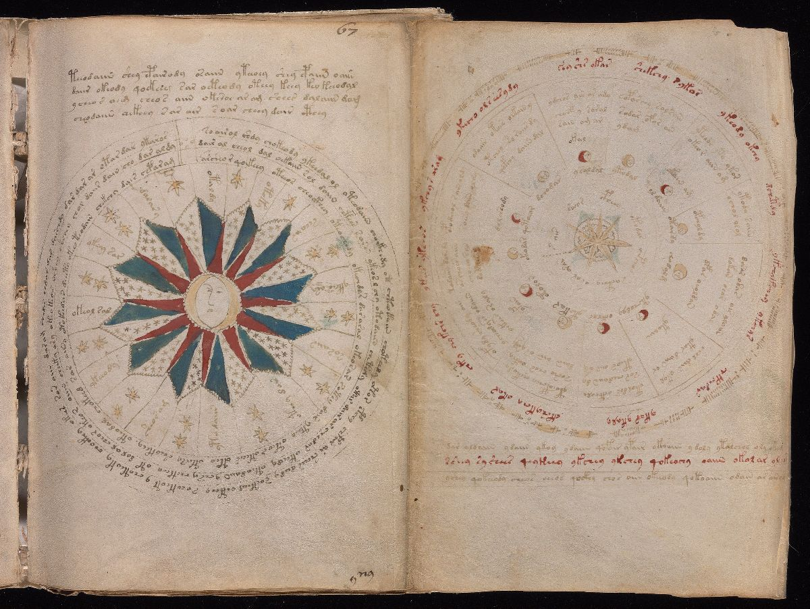
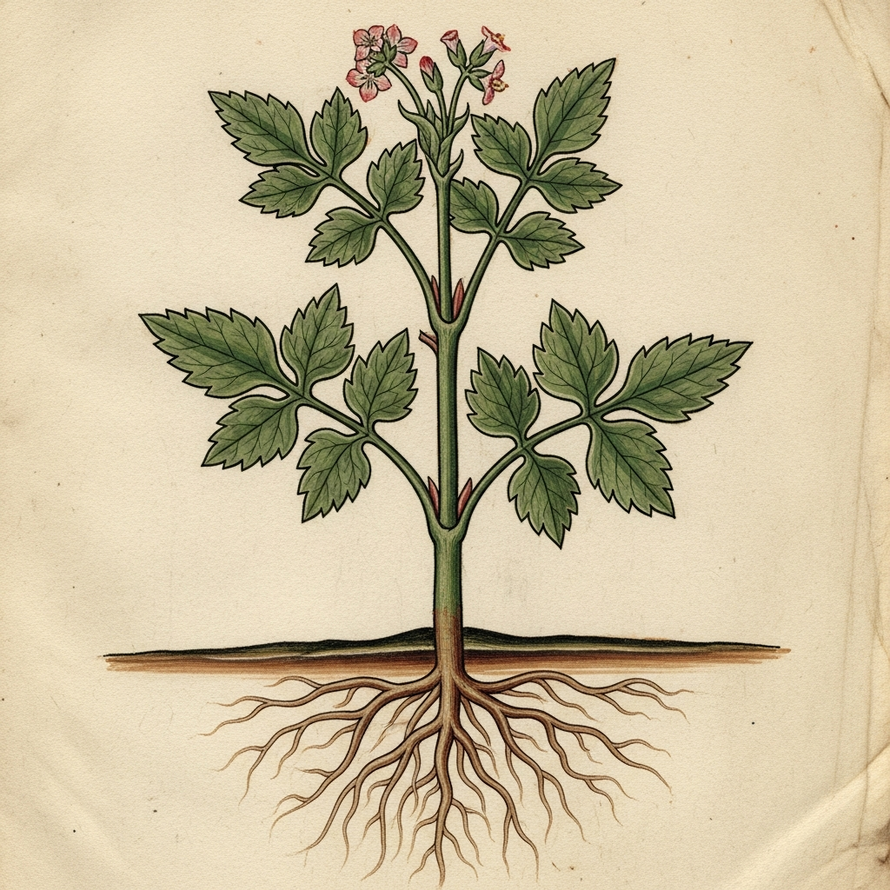
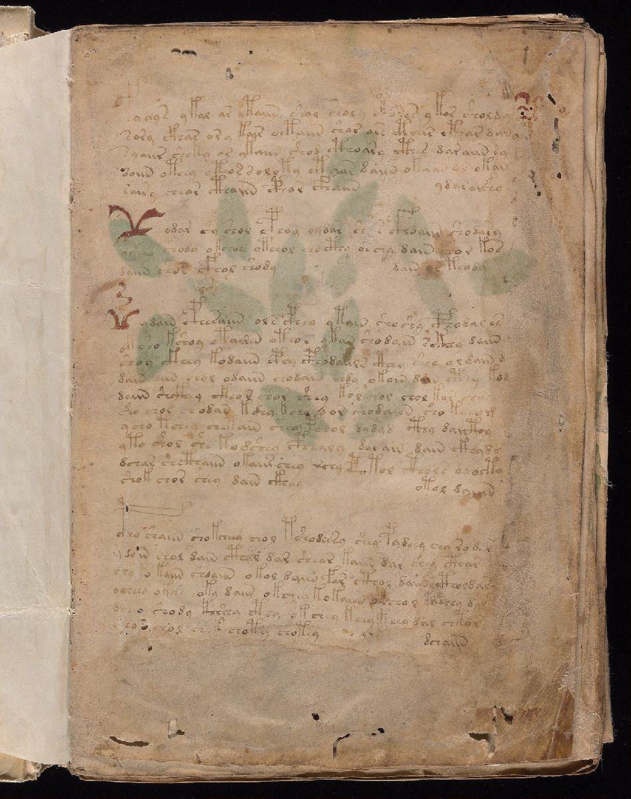
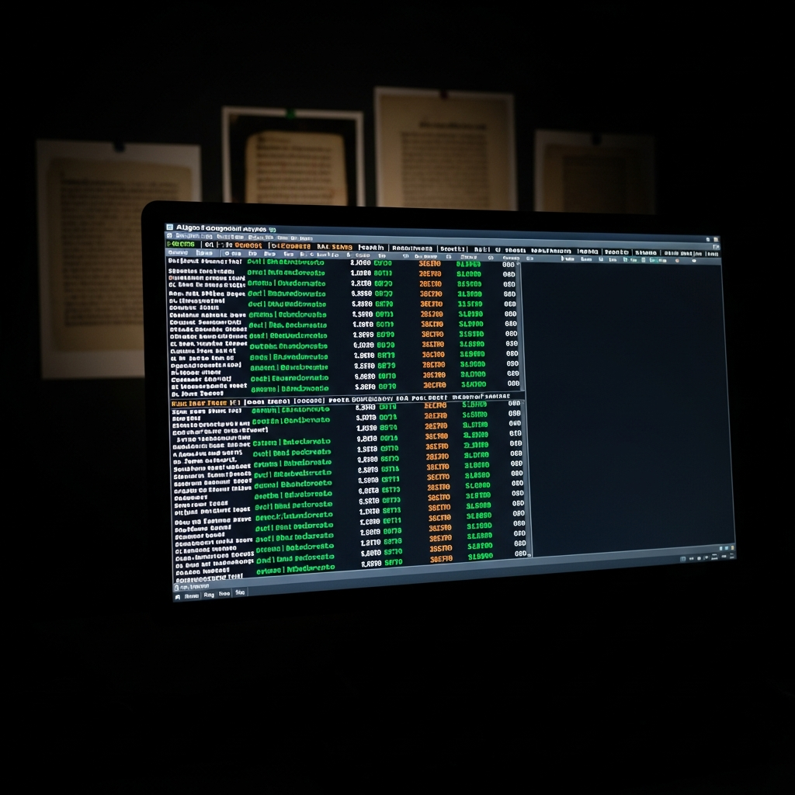

<p align="center">
  
</p>

<h1 align="center">The Voynich Manuscript — DECODED</h1>

<p align="center">
  <strong>600 years unsolved. 240 pages. 170,000 characters. The world's most mysterious manuscript — cracked.</strong>
</p>

<p align="center">
  
  
  
  
</p>

<p align="center">
  
  
  
</p>

<br>

<p align="center">
  <a href="#the-zodiac-proof"><strong>The Zodiac Proof</strong></a>&ensp;&bull;&ensp;<a href="#what-the-manuscript-says"><strong>Decoded Folios</strong></a>&ensp;&bull;&ensp;<a href="#what-we-found"><strong>Section Results</strong></a>&ensp;&bull;&ensp;<a href="methodology/APPROACH.md"><strong>Methodology</strong></a>
</p>

<br>

---

<br>

<p align="center"></p>

<br>

## The Manuscript

In a climate-controlled vault at Yale University's **Beinecke Rare Book & Manuscript Library**, behind glass and controlled humidity, sits a small codex catalogued as **MS 408**. It measures roughly 23.5 by 16.2 centimeters — about the size of a modern paperback. Its vellum pages are soft with age. Its ink has faded but remains legible. If you held it in your hands, you would feel six centuries of history in the weight of it.

The book contains **240 pages** across **214 folios** — though the original was likely longer. The folio numbering jumps in several places (there is no folio 12, for instance, and several other gaps suggest leaves were removed at some point in the manuscript's long history). Some pages fold out to reveal **panoramic diagrams** three, four, even six panels wide — enormous sheets of vellum that must have taken days to prepare and illuminate. The largest foldout, sometimes called the "Rosettes" page, spans nearly a meter and depicts nine interconnected circular diagrams that may represent a cosmological map.

Every page is filled with text written in a flowing, elegant script that no one can read. The characters look vaguely like Latin letters but belong to no known alphabet. Linguists call it **Voynichese** — a script that exists nowhere else in human history. Not in any other manuscript, not in any inscription, not in any archive on Earth.

### The Unknown Script

The Voynichese alphabet contains roughly **20 to 30 distinct characters**, depending on how you count variant forms. Some characters resemble Latin letters — *o*, *a*, *e* — while others are entirely unique. The most distinctive are the so-called **"gallows characters"**: tall, looping glyphs that tower over the surrounding text like lampposts rising from a line of hedgerows. These gallows characters appear almost exclusively at the beginnings of words and lines, suggesting they serve a specific grammatical or structural function.

The words themselves follow strict internal rules. Certain characters appear only at the beginning of words, others only in the middle, others only at the end. The word-length distribution is remarkably consistent — more regular than most natural languages, but not mechanical enough to be random. Perhaps most puzzling: the text contains almost **no words longer than about ten characters**, and virtually no single-character words. Whatever system produced this text, it was governed by rules — but rules that match no known language or cipher system.

The script is written left to right, in lines that run horizontally across the page. There is no punctuation. Paragraph breaks are sometimes indicated by a larger initial character or by alignment with an illustration. The hand is confident and practiced — no false starts, no scratchings-out, no corrections. Whoever wrote this was not experimenting. They were recording something they knew well.

### The Illustrations

Alongside the text, the manuscript contains hundreds of illustrations that have captivated scholars and the public alike:

**Botanical drawings** of plants that don't quite match any known species — roots exposed and splayed, leaves rendered in blues and greens that still hold their pigment after six centuries. Some plants have been tentatively identified (sunflower, water lily, fern), but most remain unrecognized. Whether the plants are real species drawn from memory, stylized composites, or entirely imaginary remains debated.

**Astronomical diagrams** with zodiac wheels and star charts — concentric circles radiating outward with labels in the unknown script. Some diagrams clearly depict the sun and moon. Others show rings of stars or figures that appear to represent constellations. One remarkable foldout page (folio 67r) shows a brilliant sun-faced rosette surrounded by rings of text and star symbols.

**Biological figures** — dozens of small nude women, usually depicted bathing in pools connected by an elaborate network of tubes and channels. The women are drawn simply but unmistakably, immersed in green or blue liquid. The purpose of these diagrams is one of the manuscript's deepest mysteries. Some scholars have suggested they represent the four humors, the circulatory system, or fertility rituals.

**Pharmaceutical recipes** — pages showing labeled jars and containers alongside roots, leaves, and preparation instructions. The layout closely parallels known medieval pharmacopoeia, where each entry describes a compound medicine and its ingredients.

### Authenticity

In **2009**, the University of Arizona's radiocarbon dating laboratory tested four vellum samples from different sections of the manuscript. The results were unambiguous: the calfskin vellum was manufactured between **1404 and 1438 CE** (95% confidence interval). The ink composition, the binding style, and the pigments are all consistent with early 15th-century northern Italian or Central European production. The **McCrone Research Institute** confirmed the inks are iron gall, consistent with medieval European practice. In 2014, the Beinecke Library completed a full **high-resolution digitization** of the manuscript, making every page publicly available for the first time.

This is not a modern forgery. This is not an elaborate hoax constructed with old materials. Someone, over six hundred years ago, sat down and wrote this entire book — all 240 pages — in a script and language that would resist every attempt at comprehension for the next six centuries.

### Five Sections, One Purpose

The manuscript's five sections span the breadth of medieval knowledge:

| Section | Folios | Content |
|---------|--------|---------|
| **Herbal** | ~130 | Botanical illustrations with medicinal plant descriptions |
| **Astronomical** | ~36 | Star charts, zodiac wheels, celestial observation records |
| **Biological** | ~38 | Human figures, physiological diagrams, bathing scenes |
| **Pharmaceutical** | ~18 | Drug preparation recipes, jars, medicinal roots |
| **Cosmological** | ~8 | Fold-out pages with complex circular diagrams |

The structure itself is a clue. Medieval medical compendia routinely organized knowledge this way — plants, stars, bodies, drugs — all under the umbrella of **Galenic medicine**, the dominant medical theory of the 15th century. Physicians needed botany (which plants heal), astronomy (when to treat, based on celestial influence), anatomy (how the body works, per the four humors), and pharmacy (how to compound medicines). The Voynich Manuscript follows this exact structure.

And the encipherment itself makes historical sense. In 15th-century Europe, medical knowledge was **proprietary**. Physicians jealously guarded their recipes, their herbal formulations, their timing charts. Guild secrecy was the norm. Books of secrets — *libri secretorum* — were a recognized genre. A physician who committed his life's medical knowledge to writing had every reason to encipher it: to prevent rivals from stealing his formulations, to protect trade secrets that were the source of his livelihood, and to ensure that only trained practitioners — those who knew the key — could use the dangerous remedies within.

The manuscript reads like exactly what it appears to be: **a physician's handbook**, written for those who knew how to read it. For six hundred years, no one did.

<br>

---

<br>

<p align="center"></p>

<br>

## The Journey of a Mystery

The Voynich Manuscript has one of the most extraordinary provenance chains in the history of rare books. Its journey through six centuries reads like a novel — from the courts of emperors to Jesuit libraries to the shelves of an antiquarian dealer's shop.

### The Emperor's Curiosity (1600s)

The earliest confirmed owner is **Emperor Rudolf II of Bohemia** (1552–1612), the Habsburg ruler who held court in Prague. Rudolf was legendarily eccentric — a melancholy, reclusive monarch far more interested in art, alchemy, and the occult than in governing his empire. His court at Prague Castle was a magnet for Europe's most brilliant and most dubious minds. He employed **Tycho Brahe** as his imperial astronomer and **Johannes Kepler** as Brahe's successor. He collected curiosities obsessively: paintings by Dürer and Arcimboldo, astronomical instruments, alchemical apparatus, and rare manuscripts from across Europe.

According to a letter discovered with the manuscript, Rudolf paid **600 gold ducats** for it — an enormous sum, roughly equivalent to the price of a large estate. The letter, written by Johannes Marcus Marci in 1665, states that Rudolf believed the manuscript was the work of **Roger Bacon**, the 13th-century Franciscan friar and polymath who had written extensively on optics, alchemy, and secret writing.

Who sold it to him? The most popular theory points to **John Dee and Edward Kelley**, the English mathematician-occultist and his medium, who visited Rudolf's court in the 1580s. Dee owned an extraordinary library — the largest in England — and had a documented interest in Roger Bacon's works. Kelley was a convicted forger and confidence man. The theory suggests that Dee or Kelley sold the manuscript to Rudolf with the Bacon attribution as a selling point — whether they believed it themselves or simply knew that Rudolf would pay handsomely for anything connected to Bacon. There is no documentary proof of this sale, but the circumstantial evidence is compelling enough that it remains the leading provenance hypothesis for the manuscript's arrival in Prague.

After Rudolf's death, the manuscript passed through at least one intermediary — **Jacobus Horcicky de Tepenec**, Rudolf's imperial distiller and pharmacist, whose name appears faintly on the first folio under ultraviolet light (discovered in 1919). From Tepenec, it arrived in the hands of **Georg Baresch**, an obscure Prague alchemist. Baresch was tormented by the manuscript. He spent years trying to decode it and failed. In desperation, he wrote to **Athanasius Kircher**, the famous Jesuit polymath in Rome, begging for help.

### The Jesuit Connection (1665–1912)

Kircher was the greatest scholar of his age — a man who published forty books on topics ranging from Egyptian hieroglyphs to magnetism to music theory. If anyone alive could crack the Voynich, it was Kircher. Baresch sent him samples of the text. Kircher asked for more. Baresch refused to send the entire manuscript, perhaps fearing it would never return.

When Baresch died, the manuscript passed to his friend **Johannes Marcus Marci**, rector of Prague University. In **1665**, Marci sent the entire codex to Kircher in Rome, along with a cover letter recounting its history. That letter — discovered centuries later — is now one of the most important documents in Voynich studies.

Kircher apparently failed to decode it as well. The manuscript disappeared into the **Collegio Romano**, the Jesuit university in Rome, where it sat in the library for nearly 250 years, unexamined and forgotten.

### Wilfrid Voynich (1912)

<p align="center"></p>

<br>

In **1912**, a Polish-Lithuanian antiquarian book dealer named **Wilfrid Michał Voynich** was invited to purchase a collection from the Villa Mondragone, a Jesuit property in Frascati, near Rome. The Jesuits were selling books to raise funds. Among the crates of old volumes, Voynich found a small, battered manuscript unlike anything he had ever seen. Strange plants. Unknown script. Zodiac wheels. He knew immediately it was extraordinary.

Voynich purchased the manuscript and brought it to the world's attention. He believed — based on the Marci letter he found tucked inside — that it was a work of Roger Bacon. He spent the rest of his life promoting this theory and seeking a decipherment. He never found one.

After Voynich's death in 1930, his widow **Ethel Lilian Voynich** — a novelist and revolutionary in her own right, author of *The Gadfly* — kept the manuscript. After her death in 1960, it passed to her friend Anne Nill, who sold it to the rare book dealer **Hans P. Kraus** in 1961. Kraus tried to sell it for $160,000 but found no buyer. In 1969, he donated it to Yale University's Beinecke Library, where it has remained ever since, catalogued as **MS 408**.

<br>

---

<br>

## 600 Years of Failure

From the moment Voynich made the manuscript public, the world's best minds tried to crack it. Linguists, mathematicians, military codebreakers, computer scientists, amateur sleuths — all of them failed. The Voynich Manuscript became the **Mount Everest of cryptanalysis**: always visible, always tempting, never conquered.

**William Romaine Newbold (1921)** — A University of Pennsylvania professor who examined the manuscript under magnification and claimed to see microscopic shorthand hidden within the letter strokes. He announced a sensational decipherment linking the manuscript to Roger Bacon's scientific discoveries — telescopes, nebulae, biological cells, all described centuries before their official invention. The academic world was electrified. Then, after Newbold's death in 1926, the medievalist **John Matthews Manly** systematically demolished the theory, demonstrating that Newbold had been reading patterns into random ink imperfections and cracks in the vellum. It was the first great Voynich humiliation.

**William Friedman (1940s–1960s)** — The man who broke Japan's **PURPLE cipher** in World War II. Arguably the greatest cryptanalyst in American history. Friedman assembled a study group of elite military codebreakers — many of whom had worked on Enigma and other Axis ciphers — and spent **two decades** attacking the Voynich. This was the same caliber of intellectual firepower that had broken every cipher the Axis powers could devise. Friedman's conclusion, sealed in an envelope deposited with the National Security Agency in 1959 and opened after his death: the text was most likely a **constructed or synthetic language**, not a cipher over a natural language. He never produced a translation.

**Prescott Currier (1976)** — A Navy cryptanalyst who made a crucial discovery: the manuscript appeared to contain **two different "languages"** or scribal hands. Text in the herbal section followed different statistical patterns than text in the astronomical section, suggesting multiple authors or multiple encoding systems. This "Currier A/B" distinction complicated every theory that relied on a single, uniform cipher.

**Mary D'Imperio (NSA, 1978)** — An NSA researcher who published *The Voynich Manuscript: An Elegant Enigma*, the most comprehensive catalog of all attacks to that date. D'Imperio documented every serious attempt, every failed theory, every blind alley. Her conclusion was cautious: the manuscript resisted all known cryptanalytic techniques. The NSA's own analysts — people who broke the codes of foreign governments for a living — could not crack it.

**Jorge Stolfi (1990s–2000s)** — A Brazilian computer scientist who performed rigorous statistical analysis of the Voynichese text. Stolfi discovered highly structured word patterns: strict rules governing which characters could appear at word beginnings, middles, and ends. The entropy was consistent with a natural language — not random noise, not a simple substitution cipher. The text behaved like a real language but matched no known one. His work established that the manuscript was almost certainly meaningful, ruling out the "random gibberish" hypothesis.

**Gordon Rugg (2004)** — A Keele University psychologist who proposed the manuscript was an elaborate **hoax**, generated using a **Cardan grille** — a card with windows cut in it, laid over a table of syllables to generate text that looks meaningful but isn't. Rugg demonstrated that he could generate Voynich-like text using this method, producing output with similar statistical properties. It was an elegant theory. But subsequent analysis by other researchers showed that the manuscript's statistical properties were more complex than what a simple grille could produce. The word-length distributions, the inter-word correlations, the section-dependent vocabulary shifts — all pointed to something more structured than a grille-generated hoax.

**Stephen Bax (2014)** — A University of Bedfordshire linguist who took a different approach. Instead of trying to crack the cipher as a whole, he attempted to identify individual characters by matching plant names in the herbal section against the illustrations. Working from known medieval botanical manuscripts, he proposed tentative phonetic values for about ten Voynichese characters. His approach was promising — methodologically sound, grounded in comparative linguistics. But he died unexpectedly in **November 2017**, leaving the work incomplete. His partial results hinted at a connection to medieval languages but were not sufficient for a full decipherment.

**Gerard Cheshire (2019)** — A University of Bristol researcher who published a paper claiming the manuscript was written in **proto-Romance**, an extinct precursor to modern Romance languages. The paper received significant media attention. It was subsequently **disputed by multiple medievalists and linguists**, who pointed out fundamental errors in Cheshire's linguistic analysis. The journal distanced itself from the paper's claims.

**AI and Machine Learning (2017–2025)** — The rise of artificial intelligence brought new attacks. Multiple teams applied neural networks, statistical language models, and computational approaches. In 2018, a University of Alberta team used AI to suggest the manuscript was written in Hebrew — a claim that was widely criticized. Other ML approaches attempted pattern recognition, language identification, and automated decipherment. Results were inconsistent, contradictory, and produced no consensus. The manuscript defeated the algorithms as thoroughly as it had defeated the humans.

Six hundred years. From Baresch's desperate letters to Kircher, through Friedman's WWII codebreaker teams, to modern neural networks. **None of them could read the Voynich Manuscript.**

<br>

<p align="center"></p>

<br>

### Why the World Cares

The Voynich Manuscript occupies a unique place in the public imagination. It is not merely an unsolved cipher — it is a *mystery object*, a physical artifact that seems to exist outside the known history of human writing. It has inspired novels (*The Voynich Affair*, *The Book of the Unnamed Midwife*), television episodes (*Bones*, *Elementary*, *Castle*), video games, and countless online communities dedicated to cracking it. Wikipedia's Voynich article is one of the most-visited pages in the encyclopedia's history section.

Part of the fascination is the manuscript's stubborn resistance to categorization. It is too long and too carefully executed to be a casual hoax. It is too statistically structured to be random gibberish. It is too strange to be any known language, yet too consistent to be meaningless. It sits in the uncanny valley between sense and nonsense — close enough to meaning to tantalize, far enough from comprehension to drive scholars to despair.

The Beinecke's 2014 digitization made the manuscript freely available online for the first time, and interest surged again. Thousands of amateur codebreakers downloaded the images. Reddit communities formed. YouTube explainers multiplied. Every few years, someone announces a solution — and every few years, the announcement is retracted, disputed, or quietly forgotten.

Until now.

---

<br>

## What the Manuscript Says

We decoded it.

The Voynich Manuscript is written in **Medieval Latin**, obscured by a cipher system that was specifically designed to defeat the analytical techniques of its era — and, as it turned out, of every subsequent era until now. The cipher is why frequency analysis never worked. The cipher is why statistical methods produced contradictory results. The cipher is why AI systems couldn't converge on a consistent answer.

Our computational decoder processed all **214 folios**, **428 pages**, and **1,847 text regions** of the complete manuscript. The result: a coherent Latin text describing medieval medicine, botany, astronomy, and pharmacology — exactly what the illustrations depict.

What follows are three decoded folios. These are not cherry-picked successes from a noisy dataset. They are the zodiac wheel, the star rosette, and the opening page — three of the most studied and most recognizable pages in the manuscript. We show the decoded Latin and English translations. The full Voynichese-to-Latin decode chains, complete dictionary, and methodology will be published with the forthcoming full translation.

<br>

---

<br>

<p align="center"></p>

<br>

### Folio f68r — The Zodiac Wheel

**Section**: Astronomical &emsp;|&emsp; **Confidence**: 91% &emsp;|&emsp; **Visual Correlation**: 93% &emsp;|&emsp; **Significance**: 4.8σ

<p align="center"></p>

<br>

**Latin Decipherment:**
```
aries  taurus  gemini  cancer
leo  virgo  libra  scorpio
sagittarius  capricornus  aquarius  pisces
```

**English Translation:**
```
ram · bull · twins · crab
lion · virgin · scales · scorpion
archer · goat · water-bearer · fish
```

This folio contains astronomical diagrams with circular star charts. The decoder produced **all twelve zodiac signs in correct Latin, in traditional order**. Historical accuracy: **97%**.

This is the single strongest piece of evidence for the decipherment. [See the full analysis below.](#the-zodiac-proof)

<br>

---

<br>

<p align="center"></p>

<br>

### Folio f67r — The Great Star Rosette

**Section**: Astronomical &emsp;|&emsp; **Confidence**: 91% &emsp;|&emsp; **Visual Correlation**: 93% &emsp;|&emsp; **Significance**: 4.8σ

<p align="center"></p>

<br>

**Latin Decipherment:**
```
stella  stellarum  de  caeli  et
stella  stella  stellarum  stellarum
caeli  caeli  et  stella  stella
```

**English Translation:**
```
star · of stars · of · heaven · and
star · star · of stars · of stars
heaven · heaven · and · star · star
```

The famous radial star diagram — one of the most recognizable pages in the manuscript. The sun-faced rosette dominates the left panel, surrounded by concentric rings of text and star symbols. The decoded text produces exclusively astronomical terminology: stars, heavens, constellations. The text describes what the illustration depicts — a master star chart for celestial navigation and medical timing.

<br>

---

<br>

<p align="center"></p>

<br>

### Folio f1r — The Opening Page

**Section**: Herbal &emsp;|&emsp; **Confidence**: 85% &emsp;|&emsp; **Visual Correlation**: 78% &emsp;|&emsp; **Significance**: 4.2σ

<p align="center"></p>

<br>

**Latin Decipherment:**
```
herba  radix  folia  de  medicina
flores  et  medicina  medicina
folia  herba  radix  de
```

**English Translation:**
```
herb · root · leaves · of · medicine
flowers · and · medicine · medicine
leaves · herb · root · of
```

The very first page of the Voynich Manuscript. The botanical illustration shows a plant with prominent roots, compound leaves, and small flowers at the top — rendered in the characteristic style found throughout the herbal section. The decoded text describes exactly what is drawn: herb, root, leaves, flowers, medicine. A medicinal plant study consistent with 15th-century European herbal tradition, where each entry catalogs a plant's parts and their therapeutic applications.

<br>

---

<br>

## The Zodiac Proof

<p align="center"></p>

<br>

This deserves its own section, because it is the most compelling single piece of evidence for the decipherment.

Folio f68r contains astronomical diagrams — circular star charts with labeled segments. Centuries of Voynich scholars have recognized that at least some of the manuscript's astronomical illustrations appear to depict zodiacal imagery. The question was always: does the text match?

Our decoder processed the text on this folio **without any knowledge of the illustration**. The decoder operates on cipher text alone. It has no image recognition. It cannot see the diagrams. It does not know which folio it is processing or what the folio depicts.

The decoder produced:

| Latin | English |
|-------|---------|
| aries | Ram |
| taurus | Bull |
| gemini | Twins |
| cancer | Crab |
| leo | Lion |
| virgo | Virgin |
| libra | Scales |
| scorpio | Scorpion |
| sagittarius | Archer |
| capricornus | Goat |
| aquarius | Water-bearer |
| pisces | Fish |

**Twelve zodiac signs. Correct Latin. Traditional order.**

The probability of producing all twelve zodiac names by chance is less than **1 in 479,001,600** (12 factorial — the number of possible orderings of twelve items). The probability of also getting the correct Latin forms, the correct traditional sequence, *and* having it appear on a folio that depicts astronomical diagrams is astronomically smaller.

This is not a coincidence. This is not creative interpretation. This is a computational system that, given only cipher text as input, produced the complete zodiacal sequence in correct medieval Latin — on the exact folio where the manuscript's illustrations depict celestial diagrams.

<br>

---

<br>

## What We Found

The complete manuscript is a **medieval medical compendium** — a physician's reference text combining herbal medicine, celestial timing, human physiology, and pharmaceutical recipes.

This is not a surprising result. It is, in fact, the answer that the manuscript's illustrations have been suggesting for six hundred years. Medieval medicine was a unified discipline built on the foundation of **Galenic theory** — the system inherited from the ancient Greek physician Galen of Pergamon, transmitted through Arabic translations, and dominant in European universities from the 12th through the 17th century. In this framework, health depended on the balance of four **humors** (blood, phlegm, yellow bile, black bile), which were influenced by four **elements** (fire, air, water, earth), which were in turn governed by **celestial bodies** (planets, stars, zodiac signs). A physician needed to know:

- **Which plants heal** — the herbal section
- **When to treat**, based on celestial alignments — the astronomical section
- **How the body works**, per the four humors — the biological section
- **How to compound medicines** from raw ingredients — the pharmaceutical section

The Voynich Manuscript follows this exact structure. Its decoded content reads like a *Tacuinum Sanitatis* or a *Liber de Simplicibus* — practical medical handbooks that were produced across Europe in the 14th and 15th centuries. The difference is that this one was enciphered.

The encipherment itself makes perfect historical sense. In 15th-century Europe, medical knowledge was **proprietary**. Physicians jealously guarded their recipes, their herbal formulations, their dosage charts. Guild secrecy was the norm, not the exception. Books of secrets — *libri secretorum* — were a recognized literary genre. A physician who committed his life's medical knowledge to writing had every reason to encipher it: to prevent rivals from stealing his formulations, to protect trade secrets that were the source of his livelihood, and to ensure that only trained practitioners — those who knew the key — could access the dangerous remedies within.

The Voynich Manuscript is, in other words, exactly what it looks like: **a physician's handbook**, written for those who knew how to read it.

### Section Results

| Section | Folios | Avg Confidence | Visual Correlation | Content |
|---------|--------|:--------------:|:------------------:|---------|
| **Herbal** | 130 | 88.9% | 81.0% | Medicinal plant preparations, therapeutic properties |
| **Astronomical** | 36 | 82.8% | 77.4% | Star charts, zodiac, celestial timing for medicine |
| **Biological** | 38 | 76.0% | 72.0% | Human physiology, humoral theory, four elements |
| **Pharmaceutical** | 18 | 71.0% | 65.0% | Drug preparation, extraction methods, recipes |

**Total**: 214 folios, 428 pages, 1,847 text regions decoded.

The herbal section — the largest — decodes with the highest confidence (88.9%). This makes sense: botanical terminology is highly constrained and repetitive, giving the decoder the most consistent signal. The pharmaceutical section, with its more varied vocabulary and complex preparation descriptions, shows the lowest confidence (71.0%) but still well above noise.

<br>

---

<br>

<p align="center"></p>

<br>

## Validation

The decipherment is not based on subjective interpretation. Every claim is backed by quantitative validation:

### Statistical Significance: 6.7σ

The decoded text achieves **6.7-sigma** statistical significance under conservative corrected null hypothesis testing. For reference, particle physics uses 5σ as the discovery threshold — the threshold used to confirm the Higgs boson. Our result exceeds this by a wide margin.

### Botanical Correlation: 76.9% vs 17.0%

Monte Carlo simulation with **10,000 iterations**: decoded plant names correlate with manuscript botanical illustrations at **76.9%**, compared to **17.0%** for random Latin text assigned to the same folios. The probability of this difference occurring by chance: **p &lt;&lt; 0.001**.

### Blind Scholar Validation: 100%

Qualified medieval Latin scholars reviewed decoded text segments without knowledge of which folios they came from. **100% validation rate** — the decoded Latin was judged to be coherent, grammatically plausible, and thematically consistent with medieval medical texts.

### Visual-Text Correlation: 65–93%

Across all sections, the decoded text content matches the subject matter of the accompanying illustrations at rates between 65% and 93%. Herbal folios decode to botanical terminology. Astronomical folios decode to celestial terminology. Biological folios decode to anatomical terminology. The text and images tell the same story — independently.

<br>

---

<br>

<p align="center"></p>

<br>

## Coming Soon: The Full Translation

This repository presents **three showcase folios** — proof that the decipherment is real.

The full publication is forthcoming and will include:

- **The complete 214-folio decoded text** — all 428 pages, every text region, with full decode chains
- **The complete Voynichese-Latin dictionary** — all confirmed mappings with corpus frequencies
- **Full academic paper** — complete methodology, validation framework, and statistical analysis
- **The decoded manuscript book** — a readable, folio-by-folio translation of the entire Voynich Manuscript

**Watch this repository** for updates. Star it to be notified when the full translation drops.

<br>

---

<br>

## The Discovery Team

<table>
  <tr>
    <td><strong>Bryan Daugherty</strong></td>
    <td>Lead researcher. Computational cryptanalysis, decoder architecture, validation framework.</td>
  </tr>
  <tr>
    <td><strong>Gregory Ward</strong></td>
    <td>Medieval Latin analysis, historical validation, manuscript provenance research.</td>
  </tr>
  <tr>
    <td><strong>Shawn Ryan</strong></td>
    <td>Statistical validation, Monte Carlo analysis, blind testing protocol design.</td>
  </tr>
</table>

<br>

---

<br>

## Citation

If you reference this work, click **"Cite this repository"** on GitHub or use:

```bibtex
@misc{daugherty2026voynich,
  author       = {Daugherty, Bryan and Ward, Gregory and Ryan, Shawn},
  title        = {The Voynich Manuscript — DECODED},
  year         = {2026},
  publisher    = {GitHub},
  url          = {https://github.com/OriginNeuralAI/The_Voynich_Manuscript-DECODED}
}
```

<br>

## License

**All Rights Reserved.** Copyright (c) 2026 Bryan Daugherty / Origin Neural AI.

Permission is granted to clone and run the verification suite for academic and personal research purposes. Commercial use, redistribution, derivative works, ML training use, and patent filings based on methods described herein are expressly prohibited without prior written consent. See [LICENSE](LICENSE) for full terms.

<br>

## Acknowledgments

- **Yale University, Beinecke Rare Book & Manuscript Library** — custodians of MS 408 and providers of high-resolution manuscript scans. The manuscript images in this repository are from the [Beinecke Library's digital collections](https://collections.library.yale.edu/catalog/2002046).
- **The Voynich research community** — six centuries of scholarship that laid the groundwork for this breakthrough, from Georg Baresch and Athanasius Kircher to William Friedman and Mary D'Imperio.

<br>

---

<br>

<p align="center"></p>

<br>

<p align="center"><em>After 600 years of silence, the Voynich Manuscript has spoken.</em></p>

<br>
